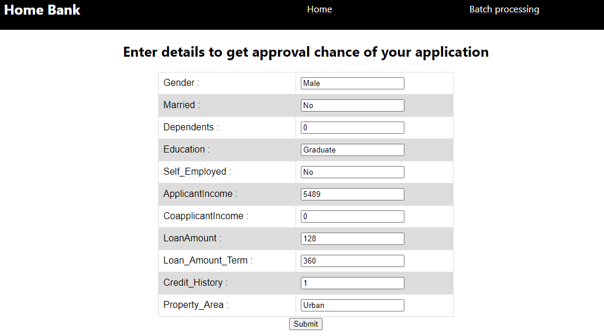

# HomeLoanClassificationAPP
Home Loan Classification application with Django and ReactJS

---

### Table of Contents

- [Description](#Description)
- [Roadmap](#Roadmap)
- [How To Use](#how-to-use)
- [Bug Or Feature Request](#Bug-Or-Feature-Request)
- [References](#references)
---

## Description

- Full-stack application using Django and React JS. 
- The problem statement is about classifying the loan application of an applicant also with a use case of batch processing of loan applications for the manager.

#### Machine Learning algorithms
- Random Forest classifier

#### Sources of the datasets
- [Kaggle : Home Loan ](https://www.kaggle.com/sazid28/home-loan)

[Back To The Top](#HomeLoanClassificationAPP)

---

## Roadmap
- Creating Pipeline to serve in Django application
- Creating Django Rest APIs
- Accept post-call in Django API
- Accept a file in Django application 
- Create ReactJS application
- Create new pages in ReactJS
- Creating a navigation bar in ReactJS
- Using React-router-dom for navigation
- Forms in ReactJS Application
- POST method in forms in ReactJS
- Upload File in ReactJS forms
- Asyn POST in ReactJS forms
- Creating a table in reactJS forms

[Back To The Top](#HomeLoanClassificationAPP)

---

## How To Use

1. Install all the libraries mentioned in the requirements.txt file.
2. Clone this repository in your local system.
4. Open another command prompt from ModelBanckend directory and run the command :
> python manage.py runserver
5. Open the command prompt from frontui directory and run the command :
> yarn start

---
## Bug or Feature Request

If you find a bug (the website couldn't handle the query and / or gave undesired results), kindly open an [issue](https://github.com/achafi/HomeLoanClassificationAPP/issues) here by including your search query and the expected result

 

[Back To The Top](#HomeLoanClassificationAPP)

---

## References
. [Full-stack Django & ReactJS || Home Loan Classification Problem || Machine Learning Application](https://www.youtube.com/watch?v=Tnto7gi6Zzo)

[Back To The Top](#HomeLoanClassificationAPP)
